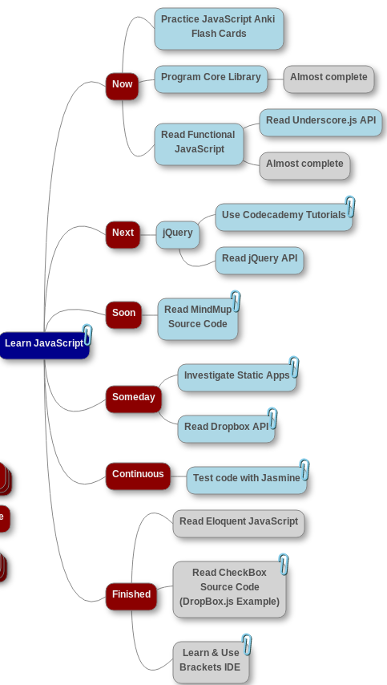

# Learning Javascript

[I am currently keeping a blog on what I have been learning.](http://thisisafiller-jon.tumblr.com/) I'm currently working mainly on the [time card app](https://github.com/jon49/Tiem), so the plan below won't be updated.

This is my path to learning Javascript. I have put a [loose plan together](http://simp.ly/publish/WRcBwL) (I'm working on it to make it better). I am [tracking my progress](http://simp.ly/publish/53WClK) as I go along. This repository will hold the actual work completed.

Here is the current plan:

